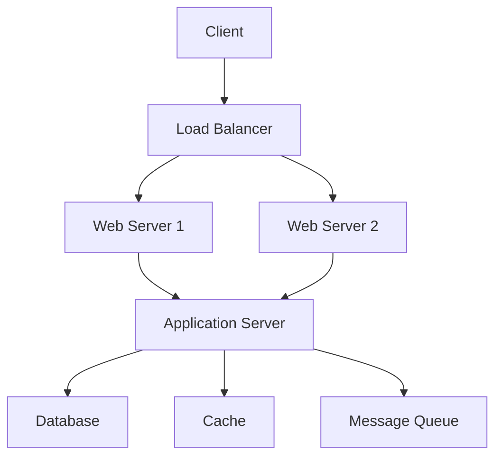

# Week 2: Planning & Architecture

## Overview
This week transforms you into an architect who can design scalable systems with AI assistance. You'll learn to think systematically about software design and leverage AI to create robust architectures.

## Learning Objectives
By the end of this week, you will:
- ✅ Design system architectures with AI assistance
- ✅ Create database schemas using AI tools
- ✅ Build RESTful and GraphQL APIs
- ✅ Implement microservices patterns
- ✅ Deploy to cloud platforms

## Day 1: System Design Fundamentals

### Morning Session: Architecture Patterns
**Duration:** 90 minutes

#### Core Architectural Patterns


#### Using AI for System Design
```javascript
// system-designer.js
async function designSystem(requirements) {
  const prompt = `
    Design a system architecture for:
    Requirements: ${requirements.functional}
    Scale: ${requirements.users} concurrent users
    Budget: ${requirements.budget}
    
    Include:
    1. Component diagram
    2. Technology choices
    3. Scaling strategy
    4. Cost estimation
  `;
  
  return await claude.complete(prompt);
}
```

### Hands-On Exercise: Design a Social Media Platform
```javascript
// Generate architecture with AI
const architecture = await designSystem({
  functional: "Social media with posts, comments, likes",
  users: 100000,
  budget: "$5000/month"
});

// Output includes:
// - Frontend: React + Next.js
// - Backend: Node.js + Express
// - Database: PostgreSQL + Redis
// - Storage: S3
// - CDN: CloudFront
```

### Afternoon Session: Microservices Architecture
**Duration:** 90 minutes

#### Service Decomposition
```yaml
# docker-compose.yml for microservices
version: '3.8'
services:
  auth-service:
    build: ./services/auth
    ports:
      - "3001:3000"
    environment:
      - JWT_SECRET=${JWT_SECRET}
      - DB_URL=postgresql://auth_db:5432/auth
  
  user-service:
    build: ./services/users
    ports:
      - "3002:3000"
    depends_on:
      - auth-service
  
  post-service:
    build: ./services/posts
    ports:
      - "3003:3000"
    depends_on:
      - auth-service
  
  api-gateway:
    build: ./gateway
    ports:
      - "3000:3000"
    depends_on:
      - auth-service
      - user-service
      - post-service
```

## Day 2: Database Design

### Morning Session: Schema Design with AI
**Duration:** 90 minutes

#### AI-Generated Schema
```sql
-- Use Claude to generate optimized schema
-- Prompt: "Design a database schema for an e-commerce platform"

CREATE TABLE users (
    id UUID PRIMARY KEY DEFAULT gen_random_uuid(),
    email VARCHAR(255) UNIQUE NOT NULL,
    password_hash VARCHAR(255) NOT NULL,
    created_at TIMESTAMP DEFAULT CURRENT_TIMESTAMP,
    updated_at TIMESTAMP DEFAULT CURRENT_TIMESTAMP
);

CREATE TABLE products (
    id UUID PRIMARY KEY DEFAULT gen_random_uuid(),
    name VARCHAR(255) NOT NULL,
    description TEXT,
    price DECIMAL(10, 2) NOT NULL,
    stock_quantity INTEGER NOT NULL DEFAULT 0,
    category_id UUID REFERENCES categories(id),
    created_at TIMESTAMP DEFAULT CURRENT_TIMESTAMP
);

CREATE TABLE orders (
    id UUID PRIMARY KEY DEFAULT gen_random_uuid(),
    user_id UUID REFERENCES users(id),
    status VARCHAR(50) NOT NULL DEFAULT 'pending',
    total_amount DECIMAL(10, 2) NOT NULL,
    created_at TIMESTAMP DEFAULT CURRENT_TIMESTAMP
);

-- Indexes for performance
CREATE INDEX idx_users_email ON users(email);
CREATE INDEX idx_products_category ON products(category_id);
CREATE INDEX idx_orders_user ON orders(user_id);
CREATE INDEX idx_orders_status ON orders(status);
```

### Hands-On Exercise: Database Migration Tool
```javascript
// migration-generator.js
const fs = require('fs').promises;

async function generateMigration(description) {
  const prompt = `
    Generate a SQL migration for: ${description}
    Include:
    1. Up migration
    2. Down migration
    3. Data validation
    4. Index optimization
  `;
  
  const migration = await claude.complete(prompt);
  const timestamp = Date.now();
  const filename = `${timestamp}_${description.replace(/\s+/g, '_')}.sql`;
  
  await fs.writeFile(`migrations/${filename}`, migration);
  console.log(`Created migration: ${filename}`);
}

// Usage
await generateMigration("add user profile table");
```

### Afternoon Session: NoSQL Design
**Duration:** 90 minutes

#### Document Design for MongoDB
```javascript
// AI-assisted MongoDB schema
const userSchema = {
  _id: ObjectId,
  email: String,
  profile: {
    name: String,
    avatar: String,
    bio: String
  },
  settings: {
    notifications: {
      email: Boolean,
      push: Boolean
    },
    privacy: {
      profileVisibility: String,
      showEmail: Boolean
    }
  },
  posts: [
    {
      _id: ObjectId,
      content: String,
      media: [String],
      likes: Number,
      comments: [
        {
          user: ObjectId,
          text: String,
          timestamp: Date
        }
      ],
      createdAt: Date
    }
  ],
  followers: [ObjectId],
  following: [ObjectId],
  createdAt: Date,
  updatedAt: Date
};

// Generate queries with AI
async function generateQuery(requirement) {
  const prompt = `Generate MongoDB query for: ${requirement}`;
  return await claude.complete(prompt);
}
```

## Day 3: API Design

### Morning Session: RESTful API Design
**Duration:** 90 minutes

#### AI-Generated API Specification
```yaml
# OpenAPI specification generated by AI
openapi: 3.0.0
info:
  title: VibeCoders API
  version: 1.0.0
  description: AI-powered bootcamp platform API

paths:
  /api/users:
    get:
      summary: List all users
      parameters:
        - name: page
          in: query
          schema:
            type: integer
            default: 1
        - name: limit
          in: query
          schema:
            type: integer
            default: 10
      responses:
        200:
          description: Successful response
          content:
            application/json:
              schema:
                type: object
                properties:
                  users:
                    type: array
                    items:
                      $ref: '#/components/schemas/User'
                  pagination:
                    $ref: '#/components/schemas/Pagination'
    
    post:
      summary: Create a new user
      requestBody:
        required: true
        content:
          application/json:
            schema:
              $ref: '#/components/schemas/UserInput'
      responses:
        201:
          description: User created
          content:
            application/json:
              schema:
                $ref: '#/components/schemas/User'

components:
  schemas:
    User:
      type: object
      properties:
        id:
          type: string
          format: uuid
        email:
          type: string
          format: email
        profile:
          $ref: '#/components/schemas/Profile'
        createdAt:
          type: string
          format: date-time
```

### Hands-On Exercise: Build an API with Express
```javascript
// api-generator.js
const express = require('express');
const router = express.Router();

// Generate CRUD endpoints with AI
async function generateCRUDEndpoints(resource) {
  const prompt = `
    Generate Express.js CRUD endpoints for ${resource}
    Include:
    1. Input validation
    2. Error handling
    3. Authentication middleware
    4. Pagination
    5. Filtering
    6. Sorting
  `;
  
  return await claude.complete(prompt);
}

// Example generated endpoint
router.get('/users', authenticate, async (req, res) => {
  try {
    const { page = 1, limit = 10, sort = 'createdAt', order = 'desc' } = req.query;
    
    const users = await User.findAll({
      limit: parseInt(limit),
      offset: (parseInt(page) - 1) * parseInt(limit),
      order: [[sort, order]]
    });
    
    const total = await User.count();
    
    res.json({
      users,
      pagination: {
        page: parseInt(page),
        limit: parseInt(limit),
        total,
        pages: Math.ceil(total / parseInt(limit))
      }
    });
  } catch (error) {
    res.status(500).json({ error: error.message });
  }
});
```

### Afternoon Session: GraphQL Design
**Duration:** 90 minutes

#### AI-Generated GraphQL Schema
```graphql
# Generated by AI based on requirements
type User {
  id: ID!
  email: String!
  profile: Profile!
  posts: [Post!]!
  followers: [User!]!
  following: [User!]!
  createdAt: DateTime!
  updatedAt: DateTime!
}

type Profile {
  name: String!
  bio: String
  avatar: String
  location: String
  website: String
}

type Post {
  id: ID!
  author: User!
  content: String!
  media: [Media!]
  likes: Int!
  comments: [Comment!]!
  tags: [String!]
  createdAt: DateTime!
}

type Query {
  user(id: ID!): User
  users(page: Int, limit: Int): UserConnection!
  post(id: ID!): Post
  posts(filter: PostFilter, page: Int, limit: Int): PostConnection!
  search(query: String!): SearchResult!
}

type Mutation {
  createUser(input: CreateUserInput!): User!
  updateProfile(input: UpdateProfileInput!): Profile!
  createPost(input: CreatePostInput!): Post!
  likePost(postId: ID!): Post!
  followUser(userId: ID!): User!
}

type Subscription {
  postCreated: Post!
  commentAdded(postId: ID!): Comment!
  userFollowed(userId: ID!): User!
}
```

## Day 4: Cloud Architecture

### Morning Session: Cloud Services Design
**Duration:** 90 minutes

#### Multi-Cloud Architecture
```javascript
// cloud-architect.js
async function designCloudArchitecture(requirements) {
  const prompt = `
    Design cloud architecture for:
    ${JSON.stringify(requirements)}
    
    Compare solutions for:
    1. AWS
    2. Google Cloud
    3. Azure
    4. Cloudflare
    
    Include:
    - Service selection
    - Cost comparison
    - Pros/cons
    - Migration strategy
  `;
  
  return await claude.complete(prompt);
}

// Example output
const architecture = {
  aws: {
    compute: "EC2 / Lambda",
    storage: "S3",
    database: "RDS / DynamoDB",
    cdn: "CloudFront",
    costEstimate: "$500/month"
  },
  gcp: {
    compute: "Compute Engine / Cloud Functions",
    storage: "Cloud Storage",
    database: "Cloud SQL / Firestore",
    cdn: "Cloud CDN",
    costEstimate: "$450/month"
  },
  cloudflare: {
    compute: "Workers",
    storage: "R2",
    database: "D1",
    cdn: "Cloudflare CDN",
    costEstimate: "$200/month"
  }
};
```

### Hands-On Exercise: Deploy to Cloudflare
```javascript
// cloudflare-worker.js
export default {
  async fetch(request, env, ctx) {
    const url = new URL(request.url);
    
    // Route handling
    if (url.pathname === '/api/users') {
      return handleUsers(request, env);
    } else if (url.pathname === '/api/posts') {
      return handlePosts(request, env);
    }
    
    return new Response('Not Found', { status: 404 });
  }
};

async function handleUsers(request, env) {
  if (request.method === 'GET') {
    const users = await env.DB.prepare(
      "SELECT * FROM users LIMIT 10"
    ).all();
    
    return Response.json(users);
  }
  
  if (request.method === 'POST') {
    const data = await request.json();
    const result = await env.DB.prepare(
      "INSERT INTO users (email, name) VALUES (?, ?)"
    ).bind(data.email, data.name).run();
    
    return Response.json({ id: result.meta.last_row_id });
  }
}
```

### Afternoon Session: Infrastructure as Code
**Duration:** 90 minutes

#### Terraform with AI
```hcl
# AI-generated Terraform configuration
terraform {
  required_providers {
    cloudflare = {
      source  = "cloudflare/cloudflare"
      version = "~> 4.0"
    }
  }
}

provider "cloudflare" {
  api_token = var.cloudflare_api_token
}

resource "cloudflare_workers_kv_namespace" "app_data" {
  title = "app-data"
}

resource "cloudflare_worker_script" "api" {
  name    = "api-worker"
  content = file("dist/worker.js")
  
  kv_namespace_binding {
    name         = "DATA"
    namespace_id = cloudflare_workers_kv_namespace.app_data.id
  }
  
  r2_bucket_binding {
    name        = "STORAGE"
    bucket_name = cloudflare_r2_bucket.assets.name
  }
}

resource "cloudflare_worker_route" "api_route" {
  zone_id = var.cloudflare_zone_id
  pattern = "api.example.com/*"
  script_name = cloudflare_worker_script.api.name
}
```

## Day 5: Architecture Review Project

### Full Day Project: Design a Complete System
**Duration:** 3 hours

#### Project: Real-time Collaboration Platform
Design and implement architecture for a platform like Figma/Google Docs

#### Requirements
- Real-time collaboration
- Version control
- User authentication
- File storage
- Commenting system
- Export functionality

#### Deliverables
```markdown
## Architecture Document

### 1. System Overview
[High-level architecture diagram]

### 2. Component Design
- Frontend: React + WebSockets
- Backend: Node.js + Socket.io
- Database: PostgreSQL + Redis
- Storage: S3-compatible
- CDN: Cloudflare

### 3. Data Flow
[Sequence diagrams for key operations]

### 4. API Specification
[OpenAPI/GraphQL schema]

### 5. Database Schema
[ERD and table definitions]

### 6. Deployment Strategy
[CI/CD pipeline and infrastructure]

### 7. Scaling Plan
[Horizontal and vertical scaling strategies]

### 8. Security Considerations
[Authentication, authorization, encryption]

### 9. Cost Analysis
[Monthly cost breakdown by service]

### 10. Implementation Timeline
[Phased rollout plan]
```

## Weekend Assignment

### Design Your Startup Architecture
1. Choose a startup idea
2. Define requirements
3. Design complete architecture
4. Create API specification
5. Implement proof of concept

### Required Deliverables
- [ ] Architecture diagram (draw.io or similar)
- [ ] API documentation (OpenAPI/GraphQL)
- [ ] Database schema with migrations
- [ ] Deployed prototype (Cloudflare Workers)
- [ ] Cost analysis spreadsheet

## Assessment Rubric

| Criteria | Basic (60%) | Proficient (80%) | Advanced (100%) |
|----------|-------------|------------------|-----------------|
| System Design | Basic components | Scalable design | Microservices |
| Database | Simple schema | Normalized | Optimized indexes |
| API Design | CRUD operations | RESTful/GraphQL | Real-time features |
| Cloud Setup | Single service | Multiple services | Multi-region |
| Documentation | Basic README | Comprehensive | Professional |

## Resources

### Required Reading
- [Designing Data-Intensive Applications](https://dataintensive.net/)
- [System Design Interview](https://www.amazon.com/System-Design-Interview-insiders-Second/dp/B08CMF2CQF)
- [Cloud Native Patterns](https://www.manning.com/books/cloud-native-patterns)

### Video Tutorials
- [System Design Fundamentals](https://youtube.com/watch?v=example)
- [Database Design Best Practices](https://youtube.com/watch?v=example)
- [API Design Patterns](https://youtube.com/watch?v=example)

### Tools & Platforms
- **draw.io**: Architecture diagrams
- **Postman**: API testing
- **TablePlus**: Database management
- **Terraform**: Infrastructure as code
- **Cloudflare**: Deployment platform

## Office Hours

**Thursday, 3-5 PM EST**
- Architecture reviews
- Database optimization
- API design consultation
- Deployment troubleshooting

## Next Week Preview

Week 3: Creating Code - Part 1
- AI pair programming
- Code generation techniques
- Refactoring with AI
- Building features fast
- Test-driven development

---

💡 **Architecture Tips:**
- Start simple, iterate often
- Design for failure
- Cache aggressively
- Monitor everything
- Document decisions

🎯 **Success Metrics:**
- Complete system design
- Deploy working prototype
- Pass all API tests
- Document architecture
- Present to peers

Ready to architect the future? Let's build! 🏗️
